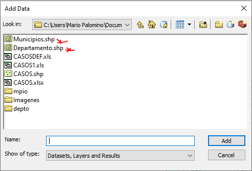

## 1. Definición del problema y fuentes de datos 

* Título del trabajo: Manejo de la red hospitalaria a raíz de los casos confirmados y potenciales casos de gravedad por COVID-19

* Descrpción y enfoque del trabajo: Con el siguiente ejercicio se busca mostrar como se daria manejo a la red hospitalaria del país (en una posible saturación), asumiendo el escenario en que los casos actuales reportados como leves empeorarán y deberan ser atendidos en un centro médico, de igual manera asumimos que aquellos municipios que no cuentan con un adecuado hospital para el manejo de estos casos, remitiran a sus contagiados al centro medico adecaudo más cercano.

* Mockup:
Una vez iniciadala pagina este será el visor principal en donde se encontraran los datos de:

* En el panel derecho de arriba hacia abajo aparecerán:
 * Estadisiticas generales: En donde estaran los datos totales de contagiados, fallecidos y recuperados.
 * Estadisticas por ciudad/municipio: En esta sección apareceran los mismos datos reportados en estadisticas generales pero discriminados por ciudad o municipio en forma de grafico de barras.
 * Estadisticas por departamento: En esta sección apareceran los mismos datos reportados en estadisticas generales pero discriminados por departamento en forma de grafico de barras.
 
* En el panel izquierdo de arriba hacia abajo aparecerán:
 * Estado sanitario: En donde estaran los datos por ciudad principal del estado en alto, medio o bajo de posible saturación hospitalaria.
 * Hositalizados por ciudad/municiio: En esta sección apareceran las cantidades de hospitalizados por cada zona.
 
 * En el panel central aparecera el mapa de Colombia con la representación volumetrica de ciudad principal con su cantidad de pacientes moderados y graves. Igualmente el área correspondiente tomara el color de su estado sanitario.

* Fuentes de datos:
  * Capa de municipios de Colombia:
    * Titulo: mpio
    * Descripción: Conjunto de poligonos representado los municipios de Colombia.
    * Enlace: https://sites.google.com/site/seriescol/shapes

  * Capa de departamentos de Colombia:
    * Titulo: depto
    * Descripción: Conjunto de poligonos representado los municipios de Colombia.
    * Enlace: https://sites.google.com/site/seriescol/shapes
    
  * Archivo en excel/Capa con los reportes de los contagiados con COVID-19:
    * Titulos: CASOS
    * Descripción: Tabla de excel con el reporte de cada ciudadano reportado como positivo por COVID-19, en el que se especifican los datos personales del ciudadano, estado actual, fecha de contagio, fecha de muerte (en algunos casos), ciudad de viviendo y sus coordenadas.
    * Enlace: https://esri.co/covid-19/    
    
  * Archivo en excel con los centros hospitalarios para atenciòn medica en Colombia:
    * Titulo: Hospitales
    * Descripción: Listado con los centros hospitalarios tanto públicos como privados por departamento y ciudad.
    
## 2. Procesamiento de datos:

* Lo que primero se hará, será cargar los datos en Arcmap, pero esto se hace clic en la opción de Add Data y seleccionamos los archivos .shp correspondientes a la capa de Municipios y Departamentos.

* Para subir los puntos guardados en la tabla de excel, hacemos clic en la misma opción de Add Data, pero esta vez seleccionamos el archivo llamado CASOSDEF.

* Una vez abierta la tabla, en la pestaña de List By Source de la tabla de contenidos, hacemos clic derecho y seleccionamos Display XY Data y en la nueva ventana emergente seleccionamos en el campo de X la longitud y en el campo Y la latitud.

* Una vez cargada la capa con los casos reportados de COVID-19, se iniciara la depuración de los datos, para esto se usara la herramienta de Select By Attributes, para seleccionar aquellos reportes cuyo estado actual sea recuperado, fallecido o asintomático, ya que ningunó de estos dos tipos de pacientes recibirá atención medica.

* Dejando por fuera 5517 casos de los 14216 casos iniciales. Con la opción de Export Data, exportamos los 8699 casos restantes se asume que los que esten catalogados como leve pasaran a moderado y tendra de recibir tancion en un centro hospitalario, este cambio lo  hacemos usando la herramienta Field Calculator:

Dejando en total 8551 casos moderados y 149 graves.

Debido a que todos los casos reportados en las ciudades cuentan con la misma coordenada, se realiza un Summarize para saber cuantos casos hay por cada ciudad o municipio.

Dando como resultado la tabla con la suma de los casos reportados en los 215 municipios y ciudades que reportan un caso positivo.

Segun la información consultada, las únicas ciudades con algún hospital (público o privado) con la infraestructura necesaria para poder atender casos de COVID-19 son los listados a continuación (la cantidad de hospitales de encuentra entre los parentésis):
 * Leticia (1)
 * Medellín (9)
 * Barranquilla (7)
 * Bogotá (16)
 * Cartagena (4)
 * Tunja (3)
 * Manizales (4)
 * Florencia (2)
 * Popayán (2)
 * Quibdó (1)
 * Chia (2)
 * Neiva (4)
 * Ipiales (2)
 * Pasto (4)
 * Tumaco (1)
 * Cúcuta (8)
 * Armenia (7)
 * Pereira (2)
 * Bucaramanga (4)
 * Sincelejo (2)
 * Ibagué (4)
 * Cali (5)
 * San Andres (1)
 * Santa Marta (1)
 * Villavicencio (2)

Dado que estas son las únicas ciudades que podiran atender casos complicados de COVID-19, las ciudades o municipios que cuenten con algun caso positivo y no tengan un centro medico adecuado, seran transportados a la ciudad con la capacidad sanitaria más cercana, dando como resultado la siguiente tabla:

A esta tabla se le agregan los siguentes atributos "Cant_Hos" que será la cantidad de hospitales mencionada más arriba, "Camas" el cual sera el numero de camas que tendran disponibles todos los hospitales de la zona, teniendo en cuenta que en promedio estos hospitales tiene 40 camas para cuidados intensivos, "Pacientes" el cual será la sumatoria de los pacientes y finalemnte el atributo "Estado" el cual será el nivel potencial de saturación de la zona, esta se calculará dividiendo la cantidad de pacientes entre la cantidad de camas. Para valores mayores 0.8 se le catalogará como Grave ya que significa que el 80% o más de las camas estan ocupadas, para valores entre 0.79 y 0.4 se le catalogará como Moderado, ya que entre el 79% y 40% de las camas estan ocupadas y menores al 0.4 serán catalagodas como Leves.

Estos atributos se adicionarán con el botón de Add Field en la tabla de atributos.

La cantidad de hospitales las ponemos manualmente activando la opción de Start Editing.

La cantidad de camas, los pacientes y el estado final se calculara con la herramiente de Field Calculator

