## 1. Cual es el problema a tratar?

El problema que se va a tratar será determinar cuales de las estaciones del Transmilenio cuentan con paraderos para libros cercanos para así determinar potenciales sitios para la ubicación de nuevos paraderos para libros y fomentar la lectura en sitios de alto flujo.

## 2. Por que los datos geográficos ayudan a resolverlo?

Los datos geográficos son esenciales en la solución de este problema ya que al tener un componente espacial se es posible tener la ubiación real de estos elementos y junto a otras capas y diferentes herramientas, es posible realizar diferentes procedimientos para llegar una mejor y más rapida solución.

## 3. Descripción de la solución propuesta.

La solución propuesta es:
+ Cargar las capas de las localidades de Bogotá, las estaciones de transmilenio y los paraderos para libros.

+ Crear un buffer de 600 metros que sera la cobertura de los paraderos de libros.

+ Determinar cuales estaciones no cuentan con cobertura de un paradero de libros.

+ Contar cuales localidades tiene menor cantidad de paraderos y una mayor cantidad de estaciones para organizar la priorización.

## 4. Listado detallado de las fuentes de datosseleccionados.

+ Capa de localidades de Bogotá:
  * Dataset:Localidades
  * Feature Class: Localidades
  * Link de descarga: https://bogota-laburbano.opendatasoft.com/explore/dataset/poligonos-localidades/export/?flg=es
 
+ Capa de Paraderos Para Libros:
  * Dataset:Paraderos
  * Feature Class: ppp
  * Link de descarga: https://datosabiertos.bogota.gov.co/dataset/paraderos-paralibros-paraparques
  
+ Capa de estaciones de transmilenio:
  * Dataset:Canchas ETra
  * Feature Class: Estaciones
  * Link de descarga: https://datosabiertos.bogota.gov.co/dataset/canchas-sinteticas
  
## 5. Geoprocesamiento.

+ Despues de cargar las tres capas, lo primero que se debe revisar es que todas las capas esten en el mismo sistema de coordenadas, encontrando que las localidades y las estaciones están en WGS 84 y los paraderos de libros están en MAGNA_SIRGAS:

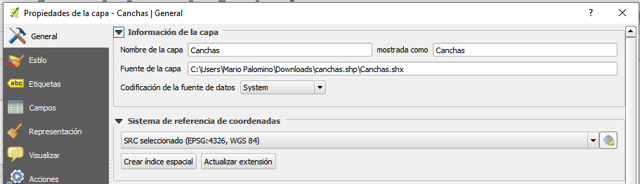
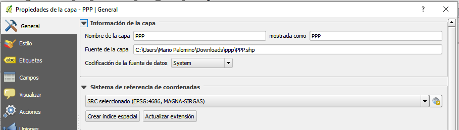

+ Para unificar las capas se pondrán las 3 en Colombia Bogota Zone:

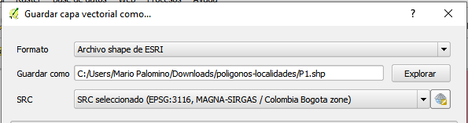

+ Obteniendo todas la capas de esta manera:

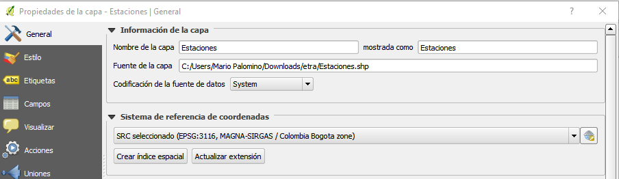

+ Despues, se hace un buffer de 600 metros para los paraderos de libros. Para esto se usa la herramienta buffer que se encuentra en la pestaña "Vector" y la opcion "Herramientas de geoproceso".

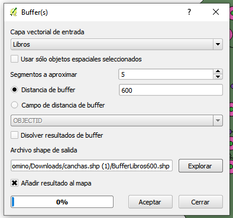

+ Obteniendo:

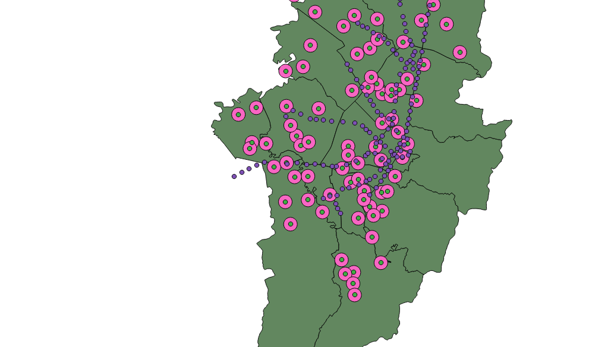

+ Despues se buscara cuantas y cuales estaciones, de las 140 estaciones, estan dentro de este buffer de cobertura usando la herramienta Seleccionar por localizacion que se encuentra en la pestaña "Vector" y la opcion "Herramientas de investigacion":

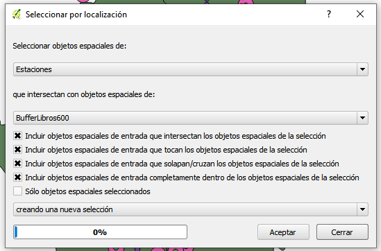

+ Obteniendo que 33 estaciones cuentan con esta cobertura y se procede a eliminar estas estaciones de la capa "Estaciones", dejando solo 107 puntos en la capa:

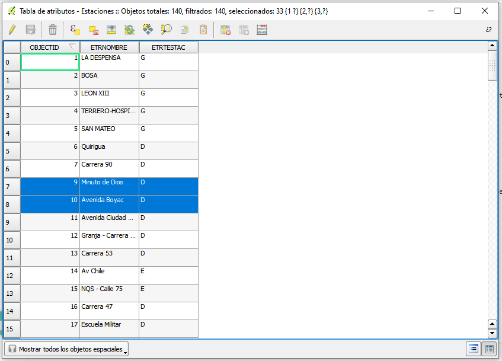

+ Para contar cuantas estaciones y paraderos hay en cada localidad se usa la herramienta "Puntos en polígonos" que se encuentra en la pestaña "Vector" y la opción "Herramientas de analisis":

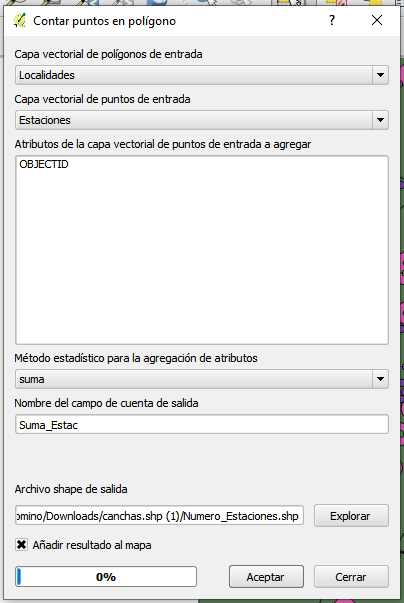
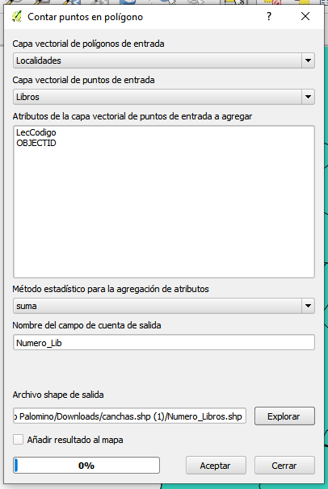

+ Obteniendo:

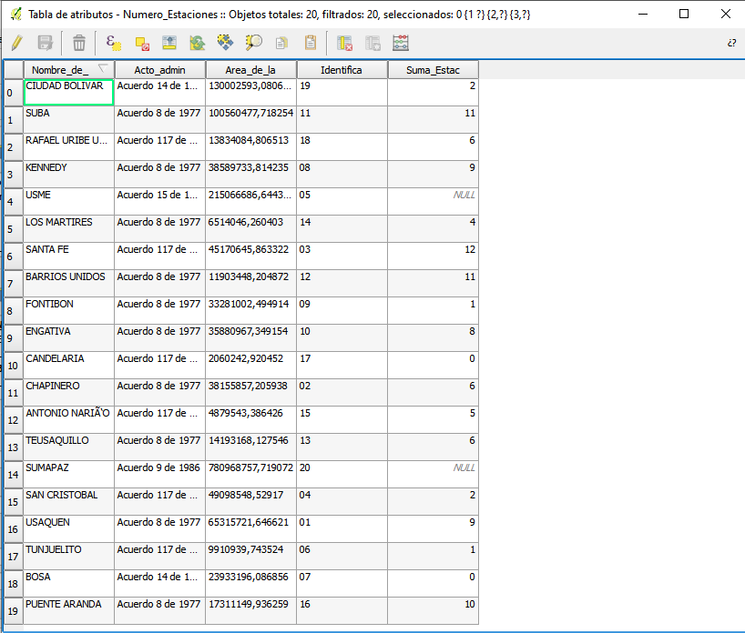
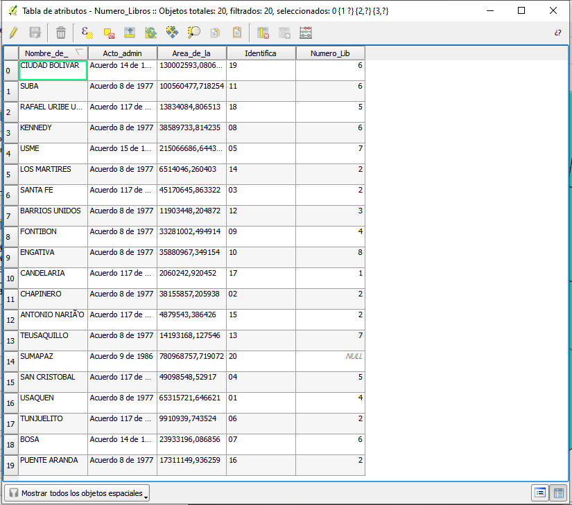

## Metodologia

+ Para la capa de localidades se dejó una transparencia de 75% y con la etiqueta de los nombres:

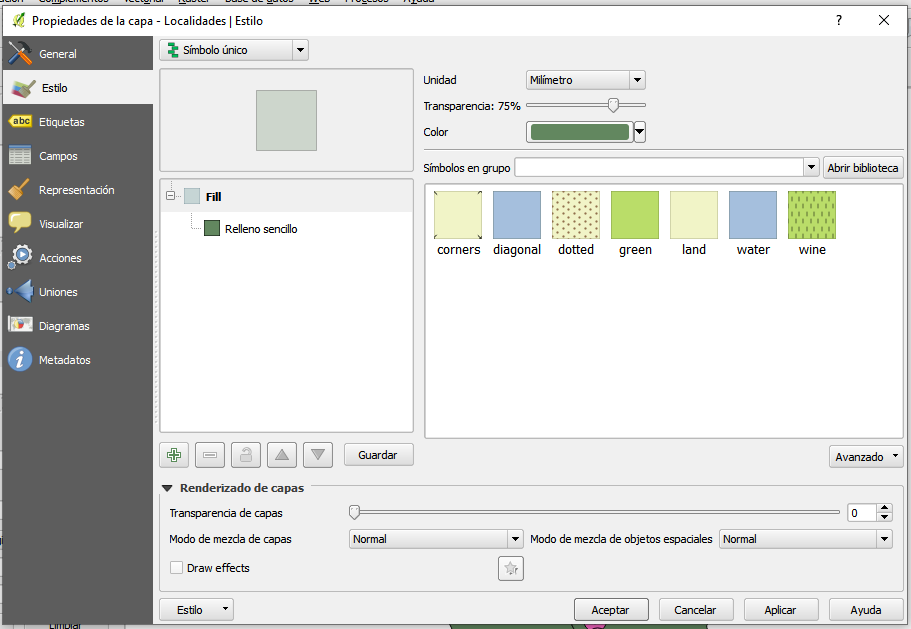
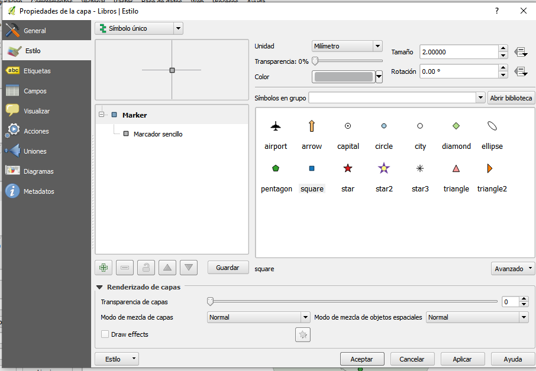

+ Para la capa de paraderos de libros se cambio a una simbologia cuadrada y un color gris:

+ Para la capa de estaciones solo se cambio el color:

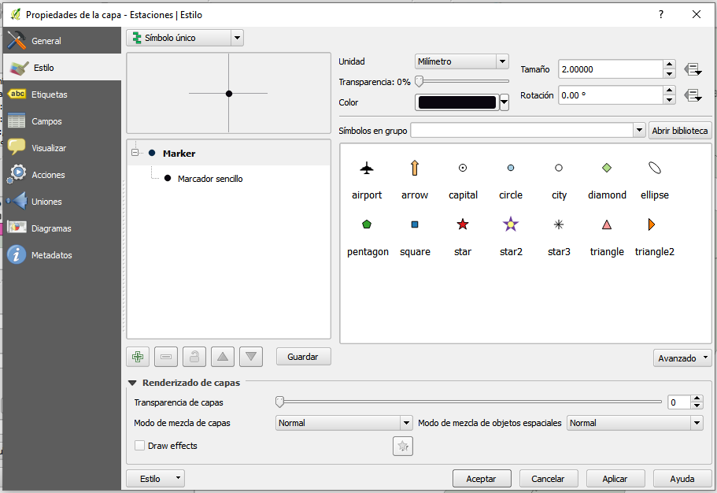

## Descripción detallada de publicación

+ Para crear la publicacion web, se usa la herramienta "Create web map", la cual se encuentra la en pestaña "Web" y en la opción "qgis2web":

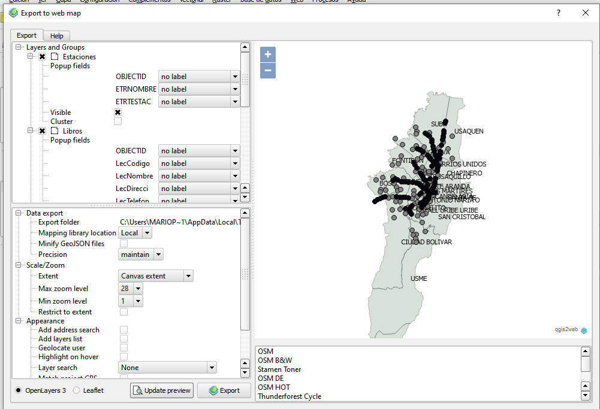

+ Se configura y se de "Exportar"

## URL del mapa

https://github.com/Mariopalomino1/geomatica/blob/master/Mapa/index.html

## Conclusiones 

+ Las localidades que tienen una mayor cantidad de estaciones que no se encuentran dentro del radio de cobertura de 600 metros de alguna parada para libros son Santa Fe con 12, Barrios Unidos y Suba con 11, Puente Aranda con 10 y Usaquen y Kennedy con 9.

+ Las localidades que tienen una menor cantidad de paradas para libros son Candelaria con 1, Tunjuelito, Puente Arande, Martires, Santa Fe y Chapinero con 2 y Barrios Unidos con #.

+ Las localidades las cuales deben ser priorizadas para la construcción de paraderos para libros son las localiades de Santa Fe, Barrios Unidos y Puente Aranda, ya que cuentan con varias estaciones de transimilenio y con muy pocas paradas para buses.

+ Para poder determinar en que parte construir estas paradas de buses es necesario realizar un analisis más grande por cada localidad para poder determinar la mejor ubicacion

  
  
